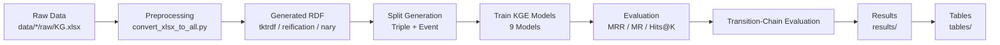

## Reproducibility Pipeline



---

# TKTRdf Benchmark: RDF Event–State Transition Representations

This repository accompanies the paper:

**"A Controlled Benchmark of RDF Event–State Transition Representations in Energy-Centric CPHSs: Structural Effects on Link and Chain Prediction"**

---

## Overview

This repository provides a **fully reproducible benchmark** for evaluating RDF-based graph representations of event–state transitions under controlled conditions.

The benchmark compares three RDF modeling strategies:

- RDF Reification  
- Canonical N-ary Relations  
- TKTRdf (Tacit Knowledge Tree RDF)

All representations are constructed such that they:

- encode identical transition semantics  
- use identical node sets  
- contain identical triple counts  

This ensures that observed differences in learning performance are attributable **only to structural properties** of the graph.

---

## Key Contributions

- Controlled benchmark for RDF-based representations  
- Structurally constrained RDF profile (TKTRdf)  
- Transition-chain prediction task for sequential reasoning  
- Evaluation across 9 KGE models  
- Comparison using both:
  - triple-level splits  
  - leakage-resistant event-level splits  

---

## Repository Structure

```
tktrdf-benchmark/
│
├── run_all.sh
├── run_experiment.py
├── requirements.txt
├── README.md
│
├── data/
│   ├── smart_building/
│   │   ├── raw/KG.xlsx
│   │   ├── tktrdf/
│   │   ├── reification/
│   │   └── nary/
│   │
│   └── smart_grid/
│       ├── raw/KG.xlsx
│       ├── tktrdf/
│       ├── reification/
│       └── nary/
│
├── scripts/
│   ├── preprocessing/
│   │   └── convert_xlsx_to_all.py
│   ├── splits/
│   └── evaluation/
│
├── results/
│   ├── raw/
│   ├── aggregate/
│   └── figures/
│
├── tables/
│
└── notebooks/
```

---

## Data

The repository includes two datasets:

- **Smart Building**
- **Smart Grid**

### Raw Data (Original Knowledge)

Raw domain knowledge is provided as Excel files:

```
data/smart_building/raw/KG.xlsx
data/smart_grid/raw/KG.xlsx
```

Each file contains structured transition information with columns:

```
Problem, Class, Type, Object, hasState, Subject, Predicate, Entity, State
```

### RDF Representations

During the pipeline, these files are automatically converted into three RDF representations:

- `tktrdf/`
- `reification/`
- `nary/`

The generated graphs are stored as:

```
data/<dataset>/<representation>/all.txt
```

---

## ✅ One-Command Reproducibility

To reproduce the full benchmark from raw Excel data:

```bash
bash run_all.sh
```

This pipeline performs:

1. Install dependencies  
2. Convert KG.xlsx → RDF graphs  
3. Generate dataset splits (triple-level + event-level)  
4. Train all KGE models  
5. Evaluate transition-chain prediction  
6. Produce results and tables  

Outputs are stored in:

```
results/
tables/
```

---

## Manual Execution (Optional)

### Install dependencies

```bash
pip install -r requirements.txt
```

### Convert Excel → RDF

```bash
python scripts/preprocessing/convert_xlsx_to_all.py
```

### Generate splits

```bash
python scripts/splits/create_triple_split.py
python scripts/splits/create_event_split.py
```

### Run experiments

```bash
python run_experiment.py
```

### Evaluate results

```bash
python scripts/evaluation/evaluate_chain_prediction.py
```

---

## Evaluation Tasks

### 1. Generic Link Prediction

Standard prediction of missing triples evaluated using:

- Mean Reciprocal Rank (MRR)
- Mean Rank (MR)
- Hits@K

---

### 2. Transition-Chain Prediction

A task where models predict the **next transition in a sequence**, evaluating:

- sequential reasoning  
- transition structure learning  

---

## Results

Results are stored in:

```
results/
```

Including:

- raw model outputs  
- aggregated metrics  
- figures used in the paper  

---

## Table Mapping

| Paper Table | File |
|------------|------|
| Table IV (MRR) | tables/table_mrr.csv |
| Table V (MR) | tables/table_mr.csv |
| Table VI (Hits SB) | tables/table_hits_sb.csv |
| Table VII (Hits SG) | tables/table_hits_sg.csv |
| Table VIII | tables/table_aggregate.csv |

---

## Key Findings

- RDF Reification performs strongest on:
  - **MRR**
  - **MR**
- TKTRdf performs strongest on:
  - **Hits@K (especially H@10)**

Performance is:

- metric-dependent  
- evaluation-dependent  

Structural regularity improves **ranking robustness**, but does not uniformly improve exact-ranking performance.

---

## Implementation Notes

- All models share identical hyperparameters across representations  
- Graph construction is fully controlled  
- All representations contain identical node sets and triple counts  
- Event-level splits prevent leakage  
- Fixed random seed (42) ensures reproducibility  

---

## License

This repository is released under the MIT License.

---

## Citation

If you use this work, please cite:

```
@article{bilal2026tktrdf,
  title={A Controlled Benchmark of RDF Event–State Transition Representations in Energy-Centric CPHSs},
  author={Bilal, Mohammad and others},
  journal={IEEE Transactions on Knowledge and Data Engineering},
  year={2026}
}
```

---

## Contact

- Mohammad Bilal  
- TU Wien – Automation Systems  
- mohammad.bilal@tuwien.ac.at  

---

## Acknowledgements

This work is supported by the SENSE project and contributions from domain experts in smart building and smart grid systems.

---
